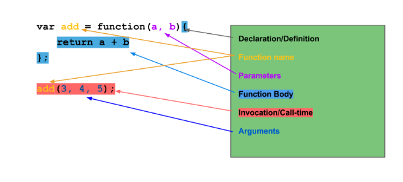

# From Fundamentals to Functional JS, v2

- A deep dive into JavaScript and functional programming techniques
- learn techniques to write professional, modern JavaScript.
- Learn core concepts of JavaScript and applying functional programming techniques to JavaScript.
- Learn higher-order functions, closures, scope and the fundamentals necessary to use modern frameworks like React, Angular and Vue.
- Master key functional methods like map, reduce and filter ...plus promises and ES6+ asynchronous JavaScript!

- **Slides links**:
  - https://slides.com/bgando/f2f-final-day-1
  - https://slides.com/bgando/f2f-final-day-2

## Objects

- We use Dot notation for only strings.
- We use brackets for: string, numbers, variables, weird characters, expressions.

> Why we use Dot then since we can use brackets for everything? =>  To save time.

### Destructuring

- it just makes getting values out of objects and arrays, have less typing.
- Variables Declarations (the patern used here called decoration patern):
  - const {first, second} = {first: 0, second:1}
  - let {first, second} = {first: 0, second:1}
  - var {first, second} = {first: 0, second:1}
- Assignement:
  - {first, second} = {first: 0, second:1}
- Chek more in objects/destructuring

## List Transformation

- check the List Transformation folder

## `forEach()` function

### `_.each()` / `forEach` DEFINED

- Iterates over a **list** of elements, passing the values to a function.
- Each invocation of **iterator**, the function, is called with three arguments: (element, index, list). If **list** is a JavaScript object, **iterator**'s arguments will be (value, key, list).
- `_.each` works for both arrays and objects.
- If we have a variable we should use brackert notation for objects instead of dot notation

```javascript
_.each(
    ['observatory','ballroom', 'library'],
    function(value, index, list){ ... }
);
['observatory','ballroom','library']
.forEach(function(value, index, list){...});
```

```javascript
function CreateSuspectObjects(name){
  return{
    name: name,
    color: name.split(' ')[1],
    speak(){log(`my name is ${name}`);}
  };
}

var suspects = ['Miss Scarlet', 'Colonel Mustard', 'Mr. White'];

var suspectsList = [];
_.each(suspects, function(name){
  suspectsList.push(CreateSuspectObjects(name));
});
```

```javascript
_.each = function(list, callback){
    // ... TODO
}
```

## `.map()` Function

- The main diff between map and foreach is that the foreach function does not return anything wherease map always return a new array.

### `_.map()` / `.map()` DEFINED

```javascript
_.map() / .map() DEFINED .map([1,2,3]
```

- http://underscorejs.org/#map
- Produces a new array of values by mapping each value in **list** through a transformation function (**iterator**).
- Each invocation of **iterator** is called with three arguments: (element, index, list). If **list** is a JavaScript object, **iterator**'s arguments will be (value, key, list)

### `_.map` vs `_.each`

```javascript
function CreateSUspectObjects(name){
    return {
        name: name,
        color: name.split(' ')[1],
        speack() {log(`my name is ${this.name}`);}
    };
}
var suspects = ['Miss Scarlet', 'Colonel Mustard'];
// _map function
var suspectsList = _.map(suspects, function(name){
    return CreateSUspectObjects(name);
});

//  _each function
_.each(suspectsList, function(suspect){
    suspects.speak();
});
```

## `.filter()` Function

- Filter is a function that takes an array in a callback. And it is going to return a new array, that only contains the values that return true from the callback. Callback have to return a bolean true of false. If the value is true then save it in the array.
- Once we implement `_.filter` function we should use `_.each` not `_.map` function coz _.map will return an array of same size and this is not waht we want.

## Functions In-Depth

### Anatomy of a Function


- **return** values are anything that is explicity returned, in this case an ES5 at least, it is explicitly returned with a return statement.
- **side effects** are things that are happening other than returning the value that effects something outside of that function.

> console.log is side effect because you are logging to the console that exists outside of that function, that is side effect. Or if you're changin the value of an object that's in a different scope.

### Arrow Functions

```javascript
var nameImprover = (name, adj) => {
  return `Col ${name} Mc ${adj} pants`;
};

$('body').hide();

myArr.forEach(val => console.log(val));

$('button').on('click', () => { 
  console.log('Don\'t press my buttons!');
});

```

### Projecting

- The projecting is once you take a value out of a data structure and turn it into another data structure

### Spread Operator

```javascript
const createTuple = (a, b, c, d) => {
  return [[a, c],[ b, d]];
}

createTuple('It', 'be', 'could', 'anyone', 'no one');
// => [['it', 'could'], ['be', 'anyone']]
```

- with spread operator

```javascript
const createTuple = (a, b, c, ...d) => {
  return [[a, c],[ b, d]];
}

createTuple('It', 'be', 'could', 'anyone', 'no one'); 
// => [ [ 'It', 'could' ], [ 'be', [ 'anyone', 'no one' ] ] ]
```

### Arguments Keyword

- The arguments keyword refrences all the arguments as a **pseudo array**.
- A psudeo array is an onkect that looks like an array, but it's actually an object.
- What does that mean? That means that we do not have access to out handy array mehtods lie push, pop, forEach, splice and stuff like that.

```javascript
const createTuple = (a, b, c, d) => {
  console.log(arguments);
    //['It', 'be', 'could', 'anyone', 'no one']
  return [[a, c],[ b, d]];
}

createTuple('It', 'be', 'could', 'anyone', 'no one');
```

```javascript
const createTuple = function(a, b, c, ...d) {
  console.log(arguments);
    //['It', 'be', 'could', 'anyone', 'no one']
  return [[a, c],[ b, d]];
}

createTuple('It', 'be', 'could', 'anyone', 'no one'); 
```

## Credits

All credits goes for From Fundamentals to Functional JS, v2 front end master course
